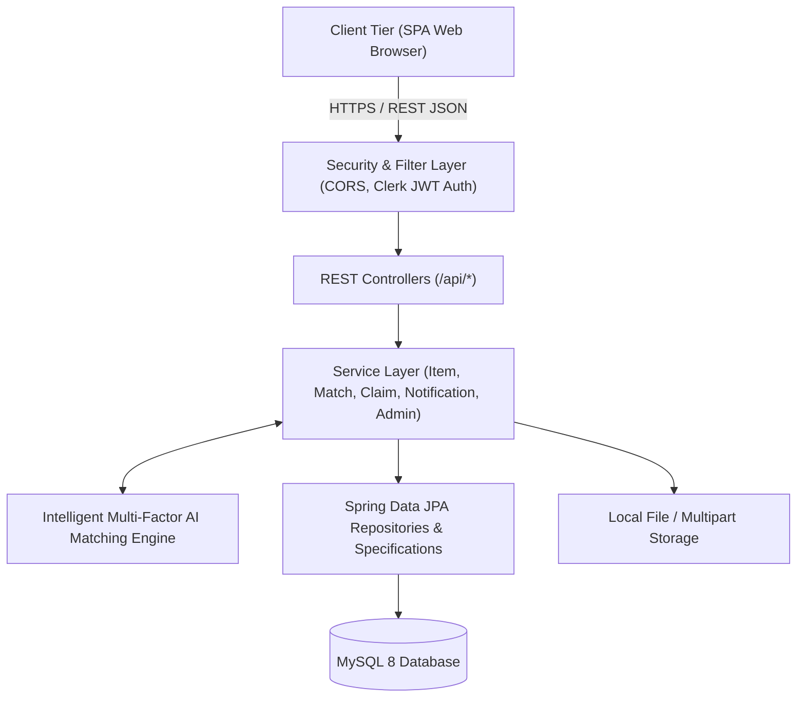
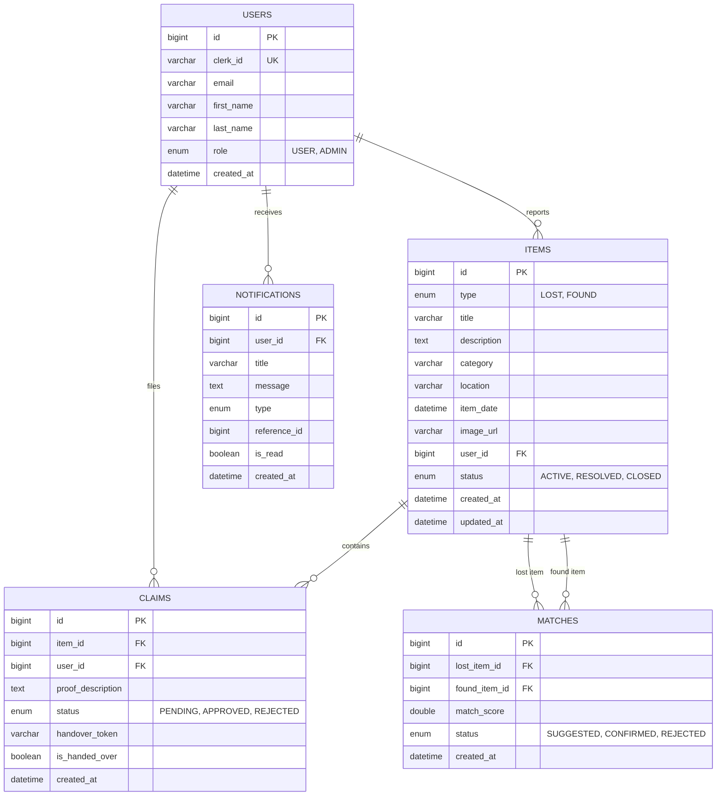
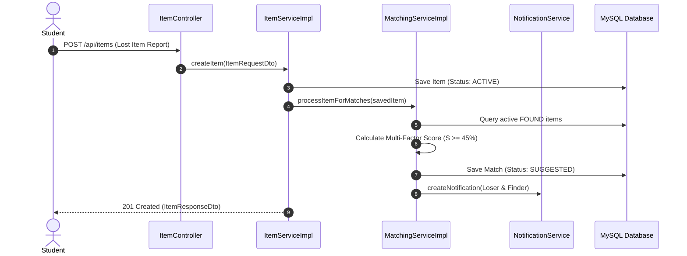
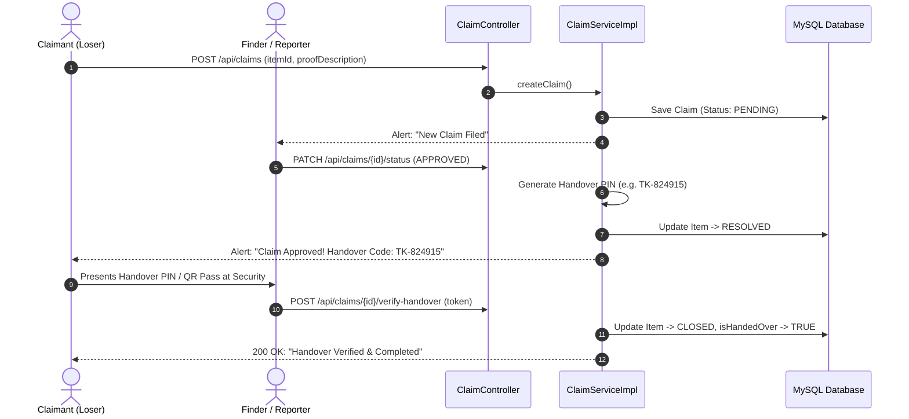

# Academic Project Report & Technical Specification

## **Campus Lost & Found System with AI-Powered Multi-Factor Matching**
### **Course Project: Web Technology & Software Engineering**
**Institution**: TSSM's Bhivarabai Sawant College of Engineering & Research (BSCOER), Pune  
**Group**: JSPM Group of Institutes, Pune  
**Department**: Department of Computer Engineering  

---

## 📋 Table of Contents
1. [Executive Summary & Abstract](#1-executive-summary--abstract)
2. [Problem Statement & Objectives](#2-problem-statement--objectives)
3. [System Architecture & Tech Stack](#3-system-architecture--tech-stack)
4. [Database Design & ER Diagram](#4-database-design--er-diagram)
5. [Core Algorithms: Multi-Factor Matching Engine](#5-core-algorithms-multi-factor-matching-engine)
6. [System Workflows & Sequence Diagrams](#6-system-workflows--sequence-diagrams)
7. [REST API Specification](#7-rest-api-specification)
8. [Security & Authentication Model](#8-security--authentication-model)
9. [Conclusion & Future Enhancements](#9-conclusion--future-enhancements)

---

## 1. Executive Summary & Abstract

Misplacing essential belongings—such as student identity cards, laptops, chargers, lab journals, keys, and accessories—is a frequent issue across large educational campuses like TSSM's BSCOER Pune. Traditional lost-and-found practices rely on manual noticeboard pins or unstructured social media groups, leading to low recovery rates, delayed communication, and false claims.

The **Campus Lost & Found Platform** is a web solution built using **Spring Boot 3 (Java 17)**, **Spring Data JPA**, **MySQL 8**, and an **SPA Web Frontend**. The platform features:
- **Intelligent Multi-Factor Matching Engine** that automatically calculates similarity scores between `LOST` and `FOUND` listings.
- **Automated In-App Notification Engine** alerting students to matching candidates and claim status changes.
- **Secure 6-Digit PIN & QR Code Handover Verification** for physical item return at the security desk.
- **Role-Based Access Control** supporting Students, Finders, and Campus Security/Administrators.

---

## 2. Problem Statement & Objectives

### **Problem Statement**
Campus communities lack a centralized, verified, and automated system to record misplaced items and match them against discovered articles, creating friction for both losers and finders.

### **Objectives**
1. Provide an accessible web directory for reporting lost and found items.
2. Automate listing pairing using a multi-factor text, category, location, and temporal similarity algorithm.
3. Establish a private, secure claim verification process preventing fraudulent item collection.
4. Supply campus administrators and security personnel with real-time analytics and CSV audit logs.

---

## 3. System Architecture & Tech Stack

### **Technology Stack**
| Layer | Technologies Used |
| :--- | :--- |
| **Backend Framework** | Spring Boot 3.2.0, Java 17 |
| **Persistence & ORM** | Spring Data JPA, Hibernate, MySQL 8 |
| **Security & Auth** | Spring Security 6, OAuth2 Resource Server (Clerk JWT) |
| **Frontend UI** | HTML5, JavaScript (ES6 Modules), Vanilla CSS Design System |
| **Testing** | JUnit 5, Mockito, Spring Security Test |
| **Tooling & Build** | Maven, Lombok |

---

## 4. Database Design & ER Diagram

---

## 5. Core Algorithms: Multi-Factor Matching Engine

When an item is reported, the `MatchingServiceImpl` executes a weighted scoring evaluation against all active complementary listings:

$$\text{Total Score } S = (W_{\text{cat}} \cdot S_{\text{cat}}) + (W_{\text{text}} \cdot S_{\text{text}}) + (W_{\text{loc}} \cdot S_{\text{loc}}) + (W_{\text{date}} \cdot S_{\text{date}})$$

### **Weight Distribution**:
1. **Category ($W_{\text{cat}} = 40\%$)**:
   - Exact category match = $1.0$
   - Partial / Parent category overlap = $0.7$
2. **Text Similarity ($W_{\text{text}} = 35\%$)**:
   - Text is normalized (tokenized, alphanumeric filtered, stop words stripped).
   - Jaccard similarity coefficient: $J(A, B) = \frac{|A \cap B|}{|A \cup B|}$ with a $40\%$ title match boost.
3. **Location ($W_{\text{loc}} = 15\%$)**:
   - Substring match / identical campus building/room keyword overlap = $0.6 - 1.0$.
4. **Date Proximity ($W_{\text{date}} = 10\%$)**:
   - $\le 1$ day difference = $1.0$
   - $\le 3$ days difference = $0.85$
   - $\le 7$ days difference = $0.65$
   - $\le 30$ days difference = $0.20$

If $S \ge 0.45$ ($45\%$), a `Match` suggestion is persisted and notifications are dispatched.

---

## 6. System Workflows & Sequence Diagrams

### **A. Item Reporting & Automated Matching**

### **B. Claim Submission, Approval & QR Handover**

---

## 7. REST API Specification

| Endpoint | Method | Role | Description |
| :--- | :--- | :--- | :--- |
| `/api/public/items` | `GET` | Public | Dynamic filtered item catalog with pagination |
| `/api/public/items/{id}` | `GET` | Public | Get single item details |
| `/api/public/categories` | `GET` | Public | List distinct campus item categories |
| `/api/public/locations` | `GET` | Public | List common campus hotspots |
| `/api/items` | `POST` | User | Create a new Lost / Found listing |
| `/api/items/my` | `GET` | User | View current authenticated user's reported items |
| `/api/items/{id}` | `PUT` | Owner/Admin | Update item listing |
| `/api/items/{id}` | `DELETE` | Owner/Admin | Remove item listing |
| `/api/claims` | `POST` | User | Submit ownership claim with proof |
| `/api/claims/my` | `GET` | User | View claims submitted by user |
| `/api/claims/received` | `GET` | User | View claims filed on user's found listings |
| `/api/claims/{id}/status` | `PATCH` | Owner/Admin | Approve or reject an ownership claim |
| `/api/claims/{id}/verify-handover` | `POST` | Finder/Admin | Validate 6-digit handover PIN token |
| `/api/matches/my` | `GET` | User | Suggested matches for user's active items |
| `/api/matches/{id}/status` | `PATCH` | User/Admin | Confirm or reject a match suggestion |
| `/api/notifications/my` | `GET` | User | Fetch in-app notifications feed |
| `/api/notifications/unread-count` | `GET` | User | Get active unread badge count |
| `/api/notifications/read-all` | `PATCH` | User | Mark all notifications as read |
| `/api/admin/stats` | `GET` | Admin | Aggregate dashboard KPIs and category charts |
| `/api/admin/export/csv` | `GET` | Admin | Download complete security audit log sheet |

---

## 8. Security & Authentication Model

1. **Stateless JWT Validation**:
   - Backend functions as an OAuth2 Resource Server validating JWT tokens signed by Clerk.
   - User identity attributes (`sub`, `email`, `given_name`) are synchronized to the local `User` entity on first authenticated call.
2. **CORS Security**:
   - Explicit CORS policy permits only trusted university origins (`http://localhost:5173`, `http://localhost:3000`).
   - Allowed methods: `GET`, `POST`, `PUT`, `PATCH`, `DELETE`, `OPTIONS`.
3. **Role-Based Authorization**:
   - General endpoints require authenticated user status.
   - Modifying actions verify ownership (`item.reporter.id == currentUser.id`) or require `ADMIN` role.
   - Admin routes (`/api/admin/**`) are restricted to users with `ADMIN` role.

---

## 9. Conclusion & Future Enhancements

The **Campus Lost & Found Platform** replaces unorganized bulletin boards with an automated, AI-assisted recovery network.

### **Future Roadmap**:
- Integration with campus smart cards via RFID/NFC readers at security gates.
- Mobile application build with push notifications via Firebase Cloud Messaging (FCM).
- Computer Vision (OpenCV / PyTorch) for image-based visual similarity matching.
